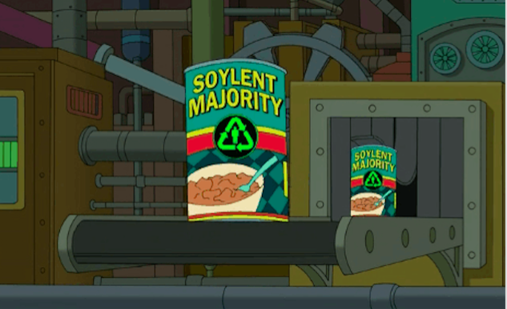

# Soylent Majority

A label for a can of Soylent Majority (from the [Decision 3012](https://futurama.fandom.com/wiki/Decision_3012) episode of [Futurama](https://en.wikipedia.org/wiki/Futurama)).

Intended to be printed on a A4 page, cut out and wrapped around a can of food, over the top of the existing label.

## Files

* [Soylent Majority.svg](./Soylent%20Majority.svg) designed in [Inkscape](https://inkscape.org/)
* [Soylent Majority.pdf](./Soylent%20Majority.pdf) exported from `Soylent Majority.svg`
* [Soylent Majority.png](./Soylent%20Majority.png) exported from `Soylent Majority.svg`

## Reference image

The reference image was downloaded from <https://brokelyn.com/app/uploads/2016/02/Screen-Shot-2016-02-05-at-9.51.55-AM.png>

